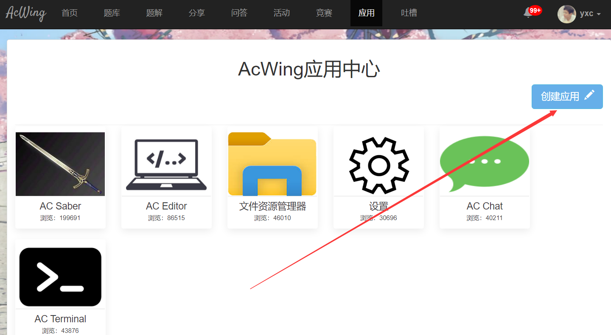
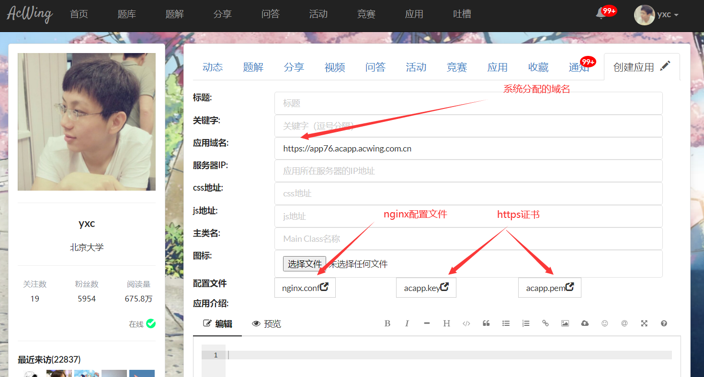
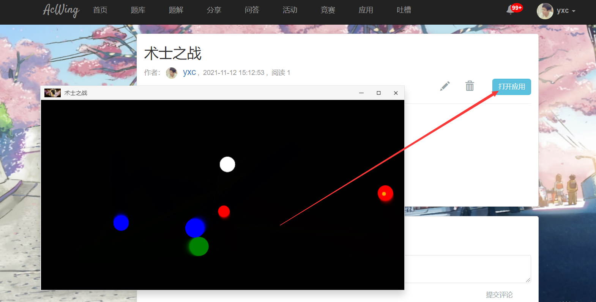

# 创建游戏界面（js制作游戏）

- 作者：yxc
- 链接：https://www.acwing.com/file_system/file/content/whole/index/content/3257028/
- 来源：AcWing
- 著作权归作者所有。商业转载请联系作者获得授权，非商业转载请注明出处。

<!-- @import "[TOC]" {cmd="toc" depthFrom=3 depthTo=3 orderedList=false} -->

<!-- code_chunk_output -->

- [部署流程](#部署流程)

<!-- /code_chunk_output -->

细分目录：

<!-- @import "[TOC]" {cmd="toc" depthFrom=3 depthTo=4 orderedList=false} -->

<!-- code_chunk_output -->

- [部署流程](#部署流程)

<!-- /code_chunk_output -->

### 部署流程

**1. 增加容器的映射端口：`80`与`443`**

第一步，登录容器，关闭所有运行中的任务。

第二步，登录运行容器的服务器，然后执行：

```bash
docker commit CONTAINER_NAME django_lesson:1.1  # 将容器保存成镜像，将CONTAINER_NAME替换成容器名称
docker stop CONTAINER_NAME  # 关闭容器
docker rm CONTAINER_NAME # 删除容器

# 使用保存的镜像重新创建容器
docker run -p 20000:22 -p 8000:8000 -p 80:80 -p 443:443 --name CONTAINER_NAME -itd django_lesson:1.1
```

第三步，去云服务器控制台，在安全组配置中开放80和443端口。

**2. 创建`AcApp`，获取域名、`nginx`配置文件及`https`证书**

打开[AcWing应用中心](https://www.acwing.com/file_system/file/content/whole/index/content/whole/application/1/)，点击“创建应用”的按钮。



系统分配的域名、`nginx`配置文件及`https`证书在如下位置：



在`服务器IP`一栏填入自己服务器的`ip`地址。

将`nginx.conf`中的内容写入服务器`/etc/nginx/nginx.conf`文件中。如果`django`项目路径与配置文件中不同，注意修改路径。

将`acapp.key`中的内容写入服务器`/etc/nginx/cert/acapp.key`文件中。

将`acapp.pem`中的内容写入服务器`/etc/nginx/cert/acapp.pem`文件中。

然后启动`nginx`服务：

```bash
sudo /etc/init.d/nginx start
```

**3. 修改django项目的配置**

打开`settings.py`文件：
- 将分配的域名添加到`ALLOWED_HOSTS`列表中。注意只需要添加`https://`后面的部分。
- 令`DEBUG = False`。

归档`static`文件：
- `python3 manage.py collectstatic`

**4. 配置uwsgi**
在`django`项目中添加`uwsgi`的配置文件`：scripts/uwsgi.ini`，内容如下：

```
[uwsgi]
socket          = 127.0.0.1:8000
chdir           = /home/acs/acapp
wsgi-file       = acapp/wsgi.py
master          = true
processes       = 2
threads         = 5
vacuum          = true
```

启动`uwsgi`服务：

```bash
uwsgi --ini scripts/uwsgi.ini
```

**5. 填写应用的剩余信息**

- 标题：应用的名称
- 关键字：应用的标签（选填）
- css地址：css文件的地址，例如：https://app179.acapp.acwing.com.cn/static/css/game.css
- js地址：js文件的地址：例如：https://app76.acapp.acwing.com.cn/static/js/dist/game.js
- 主类名：应用的`main class`，例如`AcGame`。
- 图标：`4:3`的图片
- 应用介绍：介绍应用，支持`markdown + latex`语法。

**6. 使分配的域名生效**

填写完服务器IP之后，点“保存”或者“提交”按钮，均可使分配的域名生效。

**7. 提交后点”打开应用”按钮，即可预览自己所写的应用**



**8. 发布应用**

等项目调试完之后，可以申请发布应用。审核通过后，你的acapp应用就可以与大家见面啦！
