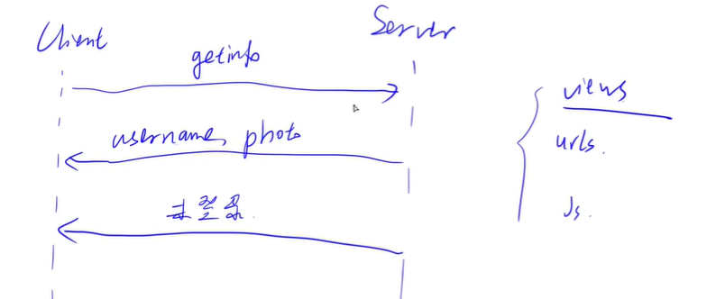

# 创建账号系统（上）

- 作者：yxc
- 链接：https://www.acwing.com/file_system/file/content/whole/index/content/3294700/
- 来源：AcWing
- 著作权归作者所有。商业转载请联系作者获得授权，非商业转载请注明出处。

<!-- @import "[TOC]" {cmd="toc" depthFrom=3 depthTo=3 orderedList=false} -->

<!-- code_chunk_output -->

- [用户数据](#用户数据)
- [开始设计登录逻辑](#开始设计登录逻辑)
- [实现用户登录注册后端](#实现用户登录注册后端)
- [实现用户登录注册前端](#实现用户登录注册前端)

<!-- /code_chunk_output -->

细分目录：

<!-- @import "[TOC]" {cmd="toc" depthFrom=3 depthTo=4 orderedList=false} -->

<!-- code_chunk_output -->

- [用户数据](#用户数据)
  - [在 models 里管理数据表](#在-models-里管理数据表)
  - [在 admin.py 中注册自定义表](#在-adminpy-中注册自定义表)
  - [执行migrations](#执行migrations)
- [开始设计登录逻辑](#开始设计登录逻辑)
  - [AcWingOS](#acwingos)
- [实现用户登录注册后端](#实现用户登录注册后端)
  - [getinfo](#getinfo)
  - [登入登出](#登入登出)
  - [实现注册](#实现注册)
  - [修改一下路由 urls](#修改一下路由-urls)
- [实现用户登录注册前端](#实现用户登录注册前端)
  - [使用ajax对应后端接口](#使用ajax对应后端接口)

<!-- /code_chunk_output -->

### 用户数据

#### 在 models 里管理数据表

Django 里创建一个新模块，就相当于创建一个新表。如下创建一个 `player` 类，记得添加 `__init__.py` 。

```bash
acs:~/acapp/game/models$ tree
.
|-- __init__.py
|-- __pycache__
|   `-- __init__.cpython-38.pyc
`-- player
    |-- __init__.py
    `-- player.py
```

`player.py` 如下：

```python
from django.db import models
from django.contrib.auth.models import User


class Player(models.Model):
    user = models.OneToOneField(User, on_delete=models.CASCADE)
    photo = models.URLField(max_length=256, blank=True)

    def __str__(self):
        return str(self.user)
```

`OneToOneField` 表示一一对应， `on_delete=models.CASCADE` 表示当数据被删掉时， `Player` 一起被删掉。

#### 在 admin.py 中注册自定义表

想让自己定义的表出现在后台管理页，则将其在 admin.py 中注册。

`admin.py` 如下。

```python
from django.contrib import admin
from game.models.player.player import Player

# Register your models here.

admin.site.register(Play)
```

#### 执行migrations

每次新定义数据表后，需要将其同步到数据库里。

```bash
acs:~/acapp$ python3 manage.py makemigrations
Migrations for 'game':
  game/migrations/0001_initial.py
    - Create model Player
acs:~/acapp$ python3 manage.py migrate   
Operations to perform:
  Apply all migrations: admin, auth, contenttypes, game, sessions
Running migrations:
  Applying game.0001_initial... OK
```

如上执行 `python3 manage.py makemigrations` 和 `python3 manage.py migrate` 两行命令。

### 开始设计登录逻辑



#### AcWingOS

y 总设计的 AcWing 应用，需要在初始化时将 `AcWingOS` 实例传入，以获取 `AcWing` 提供的各种接口。

比如在 `game/static/js/src/zbase.js` 中：

```js
export class AcGame {
    constructor(id, AcWingOS) {
        this.id = id;
        this.$ac_game = $('#' + id);
        this.AcWingOS = AcWingOS;

        this.settings = new Settings(this);
        this.menu = new AcGameMenu(this);
        this.playground = new AcGamePlayground(this);

        this.start();
    }

    start() {
    }
}
```

### 实现用户登录注册后端

#### getinfo

在 `game/views/settings/getinfo.py` 中定义返回用户数据的逻辑。

```python
from django.http import JsonResponse
from game.models.player.player import Player

# 如何从 acapp 获取没实现完
def getinfo_acapp(request):
    player = Player.objects.all()[0]
    return JsonResponse({
        'result': "success",
        'username': player.user.username,
        'photo': player.photo,
    })

def getinfo_web(request):
    user = request.user
    if not user.is_authenticated:
        return JsonResponse({
            'result': "未登录"
        })
    else:
        player = Player.objects.all()[0]
        return JsonResponse({
            'result': "success",
            'username': player.user.username,
            'photo': player.photo,
        })

def getinfo(request):
    platform = request.GET.get('platform')
    if platform == "ACAPP":
        return getinfo_acapp(request)
    elif platform == "WEB":
        return getinfo_web(request)
```

#### 登入登出

在 `game/views/settings/login.py` ：

```python
from django.http import JsonResponse
from django.contrib.auth import authenticate, login


def signin(request):
    data = request.GET
    username = data.get('username')
    password = data.get('password')
    user = authenticate(username=username, password=password)
    if not user:
        return JsonResponse({
            'result': "用户名或密码不正确"
        })
    login(request, user)
    return JsonResponse({
        'result': "success"
    })
```

在 `game/views/settings/logout.py`：

```python
from django.http import JsonResponse
from django.contrib.auth import logout

def signout(request):
    user = request.user
    if not user.is_authenticated:
        return JsonResponse({
            'result': "success",
        })
    logout(request)
    return JsonResponse({
        'result': "success",
    })
```

#### 实现注册

在 `game/views/settings/register.py` ：

```python
from django.http import JsonResponse
from django.contrib.auth import login
from django.contrib.auth.models import User
from game.models.player.player import Player

def register(request):
    data = request.GET
    username = data.get("username", "").strip()
    password = data.get("password", "").strip()
    password_confirm = data.get("password_confirm", "").strip()
    if not username or not password:
        return JsonResponse({
            'result': "用户名和密码不能为空"
        })
    if password != password_confirm:
        return JsonResponse({
            'result': "两个密码不一致",
        })
    if User.objects.filter(username=username).exists():
        return JsonResponse({
            'result': "用户名已存在"
        })
    user = User(username=username)
    user.set_password(password)
    user.save()
    Player.objects.create(user=user, photo="https://img2.baidu.com/it/u=2161949891,656888789&fm=26&fmt=auto")
    login(request, user)
    return JsonResponse({
        'result': "success",
    })
```

#### 修改一下路由 urls

在 `game/urls/settings/index.py` ：

```python
from django.urls import path
from game.views.settings.getinfo import getinfo
from game.views.settings.login import signin
from game.views.settings.logout import signout
from game.views.settings.register import register


urlpatterns = [
    path("getinfo/", getinfo, name="settings_getinfo"),
    path("login/", signin, name="settings_login"),
    path("logout/", signout, name="settings_logout"),
    path("register/", register, name="settings_register"),
]
```

如上我们把后端的接口调好了。

### 实现用户登录注册前端

#### 使用ajax对应后端接口

在 `game/static/js/src/settings/zbase.js` 中：

```js
class Settings {
    constructor(root) {
        this.root = root;
        this.platform = "WEB";
        if (this.root.AcWingOS) this.platform = "ACAPP";
        this.username = "";
        this.photo = "";

        this.$settings = $(`
<div class="ac-game-settings">
    <div class="ac-game-settings-login ...
`)

        // y 总通过比较原始的 jQuery 实现元素绑定
        this.$login = this.$settings.find(".ac-game-settings-login");
        this.$login_username = this.$login.find(".ac-game-settings-username input");
        this.$login_password = this.$login.find(".ac-game-settings-password input");
        this.$login_submit = this.$login.find(".ac-game-settings-submit button");
        this.$login_error_message = this.$login.find(".ac-game-settings-error-message");
        this.$login_register = this.$login.find(".ac-game-settings-option");

        this.$login.hide();

        this.$register = this.$settings.find(".ac-game-settings-register");
        this.$register_username = this.$register.find(".ac-game-settings-username input");
        this.$register_password = this.$register.find(".ac-game-settings-password-first input");
        this.$register_password_confirm = this.$register.find(".ac-game-settings-password-second input");
        this.$register_submit = this.$register.find(".ac-game-settings-submit button");
        this.$register_error_message = this.$register.find(".ac-game-settings-error-message");
        this.$register_login = this.$register.find(".ac-game-settings-option");

        this.$register.hide();

        this.root.$ac_game.append(this.$settings);

        this.start();
    
    start() {
        this.getinfo();
        this.add_listening_events();
    }

    add_listening_events() {
        this.add_listening_events_login();
        this.add_listening_events_register();
    }

    add_listening_events_login() {
        let outer = this;

        this.$login_register.click(function () {
            outer.register();
        });
        this.$login_submit.click(function () {
            outer.login_on_remote();
        });
    }

    add_listening_events_register() {
        let outer = this;
        this.$register_login.click(function () {
            outer.login();
        });
        this.$register_submit.click(function () {
            outer.register_on_remote();
        });
    }

    login_on_remote() {  // 在远程服务器上登录
        let outer = this;
        let username = this.$login_username.val();
        let password = this.$login_password.val();
        this.$login_error_message.empty();

        $.ajax({
            url: "https://app160.acapp.acwing.com.cn/settings/login/",
            type: "GET",
            data: {
                username: username,
                password: password,
            },
            success: function (resp) {
                console.log(resp);
                if (resp.result === "success") {
                    location.reload();
                } else {
                    outer.$login_error_message.html(resp.result);
                }
            }
        });
    }

    register_on_remote() {  // 在远程服务器上注册
        let outer = this;
        let username = this.$register_username.val();
        let password = this.$register_password.val();
        let password_confirm = this.$register_password_confirm.val();
        this.$register_error_message.empty();

        $.ajax({
            url: "https://app160.acapp.acwing.com.cn/settings/register/",
            type: "GET",
            data: {
                username: username,
                password: password,
                password_confirm: password_confirm,
            },
            success: function (resp) {
                console.log(resp);
                if (resp.result === "success") {
                    location.reload();  // 刷新页面
                } else {
                    outer.$register_error_message.html(resp.result);
                }
            }
        });
    }

    logout_on_remote() {  // 在远程服务器上登出
        if (this.platform === "ACAPP") return false;

        $.ajax({
            url: "https://app160.acapp.acwing.com.cn/settings/logout/",
            type: "GET",
            success: function (resp) {
                console.log(resp);
                if (resp.result === "success") {
                    location.reload();
                }
            }
        });
    }

    register() {  // 打开注册界面
        this.$login.hide();
        this.$register.show();
    }

    login() {  // 打开登录界面
        this.$register.hide();
        this.$login.show();
    }

    getinfo() {
        let outer = this;

        // 使用 ajax 通信如下    
        $.ajax({
            url: "https://app160.acapp.acwing.com.cn/settings/getinfo/",
            type: "GET",
            data: {
                platform: outer.platform,
            },
            success: function (resp) {
                console.log(resp);
                if (resp.result === "success") {
                    outer.username = resp.username;
                    outer.photo = resp.photo;
                    outer.hide();
                    outer.root.menu.show();
                } else {
                    outer.login();
                }
            }
        });
    }

    hide() {
        this.$settings.hide();
    }

    show() {
        this.$settings.show();
    }
}
```

总结：
- y 总通过比较原始的 `jQuery` 实现元素绑定
- 使用 `ajax` 进行 `get` 请求
- 使用 `location.reload();` 刷新页面

现在，在用户界面注册，可以直接存在数据库里，在 `https://app160.acapp.acwing.com.cn/admin/` 可以看到。
