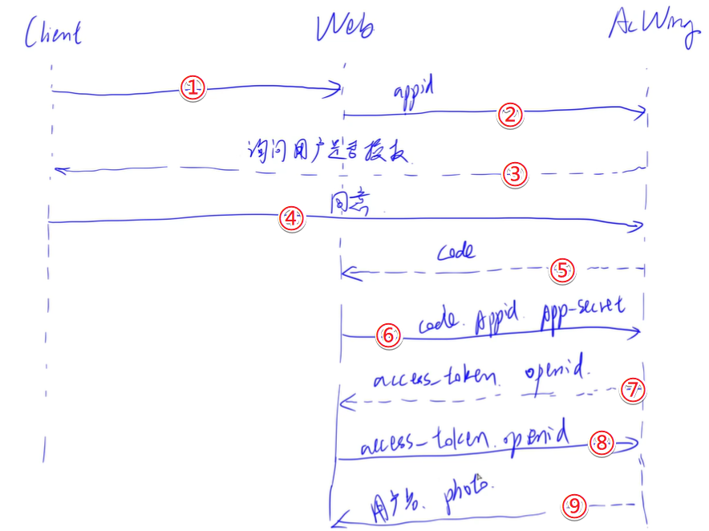

# 创建账号系统（中）（简单应用Redis与授权第三方）

- 作者：yxc
- 链接：https://www.acwing.com/blog/content/12466/
- 来源：AcWing
- 著作权归作者所有。商业转载请联系作者获得授权，非商业转载请注明出处。

<!-- @import "[TOC]" {cmd="toc" depthFrom=3 depthTo=3 orderedList=false} -->

<!-- code_chunk_output -->

- [在Django中集成Redis](#在django中集成redis)
- [网站授权登录（OAUTH）](#网站授权登录oauth)

<!-- /code_chunk_output -->

细分目录：

<!-- @import "[TOC]" {cmd="toc" depthFrom=3 depthTo=4 orderedList=false} -->

<!-- code_chunk_output -->

- [在Django中集成Redis](#在django中集成redis)
  - [Redis简介](#redis简介)
  - [配置django_redis步骤](#配置django_redis步骤)
  - [认识 cache](#认识-cache)
- [网站授权登录（OAUTH）](#网站授权登录oauth)
  - [OAUTH流程简述](#oauth流程简述)
  - [首先扩展Player类（主要加openid标记）](#首先扩展player类主要加openid标记)

<!-- /code_chunk_output -->

### 在Django中集成Redis

#### Redis简介

在 Django 中默认的数据库是 `sqlite` ，而将数据库更改为 `mysql` 或者 `redis` 是很容易的。

Redis 特点：
- 内存数据库
- 不是以表存储，是以 `key-value` 对
- 单线程

#### 配置django_redis步骤

1. 安装`django_redis`
```bash
pip install django_redis
```

2. 配置settings.py
```python
CACHES = { 
    'default': {
        'BACKEND': 'django_redis.cache.RedisCache',
        'LOCATION': 'redis://127.0.0.1:6379/1',
        "OPTIONS": {
            "CLIENT_CLASS": "django_redis.client.DefaultClient",
        },  
    },  
}
USER_AGENTS_CACHE = 'default'
```

这将允许我们使用 `django.core.cache` 中的 `cache` 。

否则会报错要求我们配置 `CACHES` ：
```
ImproperlyConfigured: Requested setting CACHES, but settings are not configured. You must either define the environment variable DJANGO_SETTINGS_MODULE or call settings.configure() before accessing settings.
```

3. 启动`redis-server`
```bash
sudo redis-server /etc/redis/redis.conf
```

启动之后可以 `top` 看一下，有没有进程叫做 `redis-server` 。

#### 认识 cache

```python
from django.core.cache import cache

cache.keys('*')  # 正则匹配所有键值，返回 []
cache.set('a', 2, 5)  # 创建一个生命时间 5s 的缓存
cache.set('b', 1, None)  # 创建一个生命时间不限的换存

# 5 秒后
cache.keys('*')  # 只返回 ['b']

# 查删
cache.has_key('b')  # True
cache.has_key('c')  # False
cache.get('b')  # 1
cache.delete('b')

cache.set('bcd', 2, None)
cache.set('acd', 2, None)
cache.keys('b*')  # ['bcd']
```

### 网站授权登录（OAUTH）

#### OAUTH流程简述



如上是 y 总讲的流程，可能不太规范，但道理是这么个道理。

`open-id` 是用户唯一标识。下面这张图是参考 QQ登录 的流程。


这里可参考我额外总结的 [OAUTH的笔记](./get_to_know_OAUTH.md) 。

#### 首先扩展Player类（主要加openid标记）

