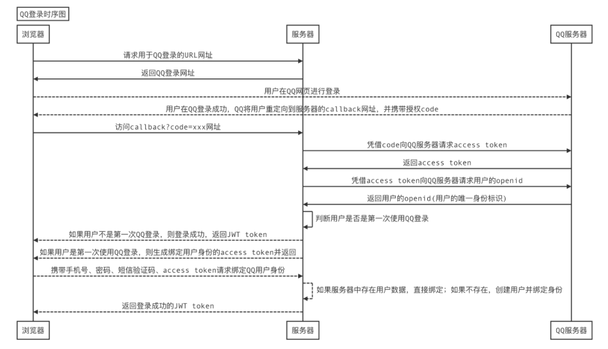

# 创建账号系统（中）（简单应用Redis与授权第三方）

- 作者：yxc
- 链接：https://www.acwing.com/blog/content/12466/
- 来源：AcWing
- 著作权归作者所有。商业转载请联系作者获得授权，非商业转载请注明出处。

<!-- @import "[TOC]" {cmd="toc" depthFrom=3 depthTo=3 orderedList=false} -->

<!-- code_chunk_output -->

- [在Django中集成Redis](#在django中集成redis)
- [网站授权登录（OAUTH）](#网站授权登录oauth)
- [Django shell](#django-shell)

<!-- /code_chunk_output -->

细分目录：

<!-- @import "[TOC]" {cmd="toc" depthFrom=3 depthTo=4 orderedList=false} -->

<!-- code_chunk_output -->

- [在Django中集成Redis](#在django中集成redis)
  - [Redis简介](#redis简介)
  - [配置django_redis步骤](#配置django_redis步骤)
  - [认识 cache](#认识-cache)
- [网站授权登录（OAUTH）](#网站授权登录oauth)
  - [OAUTH流程简述](#oauth流程简述)
  - [首先扩展Player类等（给数据库加openid）](#首先扩展player类等给数据库加openid)
  - [后端相关流程](#后端相关流程)
  - [前后端实现要点](#前后端实现要点)
- [Django shell](#django-shell)

<!-- /code_chunk_output -->

### 在Django中集成Redis

#### Redis简介

在 Django 中默认的数据库是 `sqlite` ，而将数据库更改为 `mysql` 或者 `redis` 是很容易的。

Redis 特点：
- 内存数据库
- 不是以表存储，是以 `key-value` 对
- 单线程

#### 配置django_redis步骤

1. 安装`django_redis`
```bash
pip install django_redis
```

2. 配置settings.py
```python
CACHES = { 
    'default': {
        'BACKEND': 'django_redis.cache.RedisCache',
        'LOCATION': 'redis://127.0.0.1:6379/1',
        "OPTIONS": {
            "CLIENT_CLASS": "django_redis.client.DefaultClient",
        },  
    },  
}
USER_AGENTS_CACHE = 'default'
```

这将允许我们使用 `django.core.cache` 中的 `cache` 。

否则会报错要求我们配置 `CACHES` ：
```
ImproperlyConfigured: Requested setting CACHES, but settings are not configured. You must either define the environment variable DJANGO_SETTINGS_MODULE or call settings.configure() before accessing settings.
```

3. 启动`redis-server`
```bash
sudo redis-server /etc/redis/redis.conf
```

启动之后可以 `top` 看一下，有没有进程叫做 `redis-server` 。

#### 认识 cache

```python
from django.core.cache import cache

cache.keys('*')  # 正则匹配所有键值，返回 []
cache.set('a', 2, 5)  # 创建一个生命时间 5s 的缓存
cache.set('b', 1, None)  # 创建一个生命时间不限的换存

# 5 秒后
cache.keys('*')  # 只返回 ['b']

# 查删
cache.has_key('b')  # True
cache.has_key('c')  # False
cache.get('b')  # 1
cache.delete('b')

cache.set('bcd', 2, None)
cache.set('acd', 2, None)
cache.keys('b*')  # ['bcd']
```

### 网站授权登录（OAUTH）

#### OAUTH流程简述


如上是 y 总讲的流程，可能不太规范，但道理是这么个道理。

`open-id` 是用户唯一标识。下面这张图是参考 QQ登录 的流程。



这里可参考我额外总结的 [OAUTH的笔记](./get_to_know_OAUTH.md) 。

#### 首先扩展Player类等（给数据库加openid）

```python
class Player(models.Model):
    user = models.OneToOneField(User, on_delete=models.CASCADE)
    photo = models.URLField(max_length=256, blank=True)
    openid = models.CharField(default="", max_length=50, blank=True, null=True)
```

如上，在 Django 中添加数据库新字段很简单。

**然后重启下数据库。**

```bash
python3 manage.py makemirgations
python3 manage.py migrate
```

然后重启 `uwsgi` 。


如上，数据库内容新增 `Openid` 。

#### 后端相关流程


<h4>第一步 申请授权码<code>code</code></h4>

请求地址：`https://www.acwing.com/third_party/api/oauth2/web/authorize/`

参考示例：

```
请求方法：GET
https://www.acwing.com/third_party/api/oauth2/web/authorize/?appid=APPID&amp;redirect_uri=REDIRECT_URI&amp;scope=SCOPE&amp;state=STATE
```

<h5>参数说明</h5>

<table>
<thead>
<tr>
<th>参数</th>
<th>是否必须</th>
<th>说明</th>
</tr>
</thead>
<tbody>
<tr>
<td>appid</td>
<td>是</td>
<td>应用的唯一id，可以在AcWing编辑AcApp的界面里看到</td>
</tr>
<tr>
<td>redirect_uri</td>
<td>是</td>
<td>需要用urllib.parse.quote对链接进行处理</td>
</tr>
<tr>
<td>scope</td>
<td>是</td>
<td>申请授权的范围。目前只需填userinfo</td>
</tr>
<tr>
<td>state</td>
<td>否</td>
<td>用于判断请求和回调的一致性，授权成功后后原样返回。该参数可用于防止csrf攻击（跨站请求伪造攻击），建议第三方带上该参数，可设置为简单的随机数</td>
</tr>
</tbody>
</table>

<h5>返回说明</h5>

用户同意授权后会重定向到`redirect_uri`，返回参数为`code`和`state`。链接格式如下：

```
redirect_uri?code=CODE&amp;state=STATE
```

如果用户拒绝授权，则不会发生重定向。

<hr />

<h4>第二步 申请授权令牌<code>access_token</code>和用户的<code>openid</code></h4>

请求地址：`https://www.acwing.com/third_party/api/oauth2/access_token/`

参考示例：

```
请求方法：GET
https://www.acwing.com/third_party/api/oauth2/access_token/?appid=APPID&amp;secret=APPSECRET&amp;code=CODE
```

<h5>参数说明</h5>

<table>
<thead>
<tr>
<th>参数</th>
<th>是否必须</th>
<th>说明</th>
</tr>
</thead>
<tbody>
<tr>
<td>appid</td>
<td>是</td>
<td>应用的唯一id，可以在AcWing编辑AcApp的界面里看到</td>
</tr>
<tr>
<td>secret</td>
<td>是</td>
<td>应用的秘钥，可以在AcWing编辑AcApp的界面里看到</td>
</tr>
<tr>
<td>code</td>
<td>是</td>
<td>第一步中获取的授权码</td>
</tr>
</tbody>
</table>
<h5>返回说明</h5>

申请成功示例：

```
{ 
    "access_token": "ACCESS_TOKEN", 
    "expires_in": 7200, 
    "refresh_token": "REFRESH_TOKEN",
    "openid": "OPENID", 
    "scope": "SCOPE",
}
```

申请失败示例：

```
{
    "errcode": 40001,
    "errmsg": "code expired",  # 授权码过期
}
```

<h5>返回参数说明</h5>

<table>
<thead>
<tr>
<th>参数</th>
<th>说明</th>
</tr>
</thead>
<tbody>
<tr>
<td>access_token</td>
<td>授权令牌，有效期2小时</td>
</tr>
<tr>
<td>expires_in</td>
<td>授权令牌还有多久过期，单位（秒）</td>
</tr>
<tr>
<td>refresh_token</td>
<td>用于刷新access_token的令牌，有效期30天</td>
</tr>
<tr>
<td>openid</td>
<td>用户的id。每个AcWing用户在每个acapp中授权的openid是唯一的,可用于识别用户。</td>
</tr>
<tr>
<td>scope</td>
<td>用户授权的范围。目前范围为userinfo，包括用户名、头像</td>
</tr>
</tbody>
</table>

<hr />

<h5>刷新access_token的有效期</h5>

`access_token`的有效期为2小时，时间较短。`refresh_token`的有效期为30天，可用于刷新`access_token`。刷新结果有两种：

- 如果<code>access_token</code>已过期，则生成一个新的<code>access_token</code>。
- 如果<code>access_token</code>未过期，则将当前的<code>access_token</code>的有效期延长为2小时。

参考示例：

```
请求方法：GET
https://www.acwing.com/third_party/api/oauth2/refresh_token/?appid=APPID&amp;refresh_token=REFRESH_TOKEN
```

返回结果的格式与申请`access_token`相同。

<hr />

<h4>第三步 申请用户信息</h4>

请求地址：`https://www.acwing.com/third_party/api/meta/identity/getinfo/`

参考示例：

```
请求方法：GET
https://www.acwing.com/third_party/api/meta/identity/getinfo/?access_token=ACCESS_TOKEN&amp;openid=OPENID
```

<h5>参数说明</h5>

<table>
<thead>
<tr>
<th>参数</th>
<th>是否必须</th>
<th>说明</th>
</tr>
</thead>
<tbody>
<tr>
<td>access_token</td>
<td>是</td>
<td>第二步中获取的授权令牌</td>
</tr>
<tr>
<td>openid</td>
<td>是</td>
<td>第二步中获取的用户openid</td>
</tr>
</tbody>
</table>

<h5>返回说明</h5>

申请成功示例：

```
{
    'username': "USERNAME",
    'photo': "https:cdn.acwing.com/xxxxx"
}
```

申请失败示例：

```
{
    'errcode': "40004",
    'errmsg': "access_token expired"  # 授权令牌过期
}
```

#### 前后端实现要点

我们本次是在 `web` 端实现 acwing 登录。

首先在 `views` 中写两个模块：
- `game/views/settings/acwing/web/apply_code.py` 给 AcWing 发送 `state` 获取 `code`
- `game/views/settings/acwing/web/receive_code.py` 获取 `code` ，给 AcWing 发送 `secret` 和 `appid` 等，获取 `access_token` 和 `openid` ；接着再用这些信息从 AcWing 请求 `userinfo` 实现用户在自己数据库中的绑定、存储，登录用户等

别忘了给文件夹添加 `__init__.py` 。

`apply_code.py`：

```python
from django.http import JsonResponse
from urllib.parse import quote
from random import randint
from django.core.cache import cache


def get_state():
    res = ""
    for i in range(8):
        res += str(randint(0, 9))
    return res


def apply_code(request):
    appid = "165"
    redirect_uri = quote("https://app165.acapp.acwing.com.cn/settings/acwing/web/receive_code/")
    scope = "userinfo"
    state = get_state()

    cache.set(state, True, 7200)   # 有效期2小时

    apply_code_url = "https://www.acwing.com/third_party/api/oauth2/web/authorize/"
    return JsonResponse({
        'result': "success",
        'apply_code_url': apply_code_url + "?appid=%s&redirect_uri=%s&scope=%s&state=%s" % (appid, redirect_uri, scope, state)
    })
```

`receive_code.py`：

```python
from django.shortcuts import redirect
from django.core.cache import cache
import requests
from django.contrib.auth.models import User
from game.models.player.player import Player
from django.contrib.auth import login
from random import randint


def receive_code(request):
    data = request.GET
    code = data.get('code')
    state = data.get('state')

    if not cache.has_key(state):
        return redirect("index")
    cache.delete(state)

    apply_access_token_url = "https://www.acwing.com/third_party/api/oauth2/access_token/"
    params = {
        'appid': "160",
        'secret': "9da264b9110443649ae71692f1ee974e",
        'code': code
    }

    access_token_res = requests.get(apply_access_token_url, params=params).json()

    access_token = access_token_res['access_token']
    openid = access_token_res['openid']

    players = Player.objects.filter(openid=openid)
    if players.exists():  # 如果该用户已存在，则无需重新获取信息，直接登录即可
        login(request, players[0].user)
        return redirect("index")

    get_userinfo_url = "https://www.acwing.com/third_party/api/meta/identity/getinfo/"
    params = {
        "access_token": access_token,
        "openid": openid
    }
    userinfo_res = requests.get(get_userinfo_url, params=params).json()
    username = userinfo_res['username']
    photo = userinfo_res['photo']

    while User.objects.filter(username=username).exists():  # 找到一个新用户名
        username += str(randint(0, 9))

    user = User.objects.create(username=username)
    player = Player.objects.create(user=user, photo=photo, openid=openid)

    login(request, user)

    return redirect("index")
```

然后修改路由以重定向：

别忘了给文件夹添加 `__init__.py` 。

新建 `game/urls/settings/acwing/index.py`：

```python
from django.urls import path
from game.views.settings.acwing.web.apply_code import apply_code
from game.views.settings.acwing.web.receive_code import receive_code


urlpatterns = [
    path("web/apply_code/", apply_code, name="settings_acwing_web_apply_code"),
    path("web/receive_code/", receive_code, name="settings_acwing_web_receive_code"),
]
```

然后修改主路由 `game/urls/settings/index.py` ：

```python
from django.urls import path, include 
from game.views.settings.getinfo import getinfo
from game.views.settings.login import signin
from game.views.settings.logout import signout
from game.views.settings.register import register


urlpatterns = [
    path("getinfo/", getinfo, name="settings_getinfo"),
    path("login/", signin, name="settings_login"),
    path("logout/", signout, name="settings_logout"),
    path("register/", register, name="settings_register"),
    path("acwing/", include("games.urls.settings.acwing.index")),  # 新增
]
```

修改一下前端，通过前端跳转到 `apply_code` 发起请求。

`game/static/js/src/settings/zbase.js` ：


### Django shell

小 tips ：

如何使用有当前 Django 项目的 Redis 缓存的 shell 呢？

```
python3 manage.py shell
```

然后就可以畅快看 `django.core.cache` 里的 `cache` 了。很舒服的设计。
