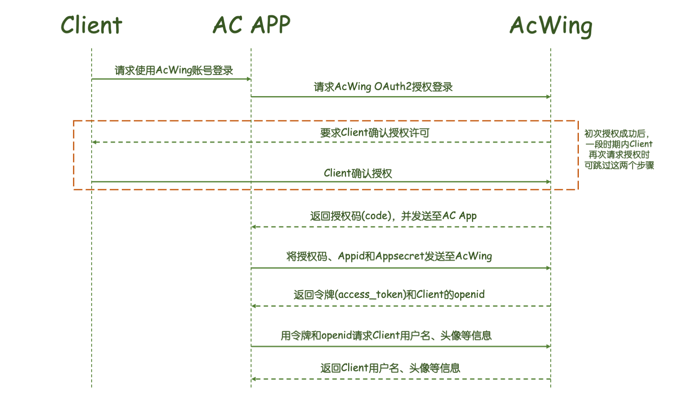

# 创建账号系统（下）（AcApp端AcWing一键登录）

- 作者：yxc
- 链接：https://www.acwing.com/blog/content/12467/
- 来源：AcWing
- 著作权归作者所有。商业转载请联系作者获得授权，非商业转载请注明出处。

<!-- @import "[TOC]" {cmd="toc" depthFrom=3 depthTo=3 orderedList=false} -->

<!-- code_chunk_output -->

- [AcApp思想与区别](#acapp思想与区别)
- [AcApp流程](#acapp流程)

<!-- /code_chunk_output -->

细分目录：

<!-- @import "[TOC]" {cmd="toc" depthFrom=3 depthTo=4 orderedList=false} -->

<!-- code_chunk_output -->

- [AcApp思想与区别](#acapp思想与区别)
- [AcApp流程](#acapp流程)
  - [后端相关流程](#后端相关流程)
  - [前后端实现要点](#前后端实现要点)

<!-- /code_chunk_output -->

### AcApp思想与区别

在 AcApp 里不需要有登录页面，会在前端调用 `AcWingOS` 对象（由 AcWing 提供）中的 API 弹出登录框。

此外，在前端 `this.root.AcWingOS.api.oauth2.authorize`需要传入一个 `callback` 函数，用于处理 AcWing 返回的数据信息。

这些都是 AcWing 平台独创，不必太纠结。

### AcApp流程

- 我的项目地址：[https://app160.acapp.acwing.com.cn/](https://app160.acapp.acwing.com.cn/)
- 我的 AcApp 地址：[https://www.acwing.com/file_system/file/content/whole/index/content/3262287/](https://www.acwing.com/file_system/file/content/whole/index/content/3262287/)
- 我的项目地址：[https://git.acwing.com/PiperLiu/acapp](https://git.acwing.com/PiperLiu/acapp)

#### 后端相关流程



<h4>第一步 申请授权码<code>code</code></h4>

请求授权码的API：

```
AcWingOS.api.oauth2.authorize(appid, redirect_uri, scope, state, callback);
```

<h5>参数说明</h5>

<table>
<thead>
<tr>
<th>参数</th>
<th>是否必须</th>
<th>说明</th>
</tr>
</thead>
<tbody>
<tr>
<td>appid</td>
<td>是</td>
<td>应用的唯一id，可以在AcWing编辑AcApp的界面里看到</td>
</tr>
<tr>
<td>redirect_uri</td>
<td>是</td>
<td>接收授权码的地址。需要用urllib.parse.quote对链接进行处理。</td>
</tr>
<tr>
<td>scope</td>
<td>是</td>
<td>申请授权的范围。目前只需填userinfo</td>
</tr>
<tr>
<td>state</td>
<td>是</td>
<td>用于判断请求和回调的一致性，授权成功后后原样返回。该参数可用于防止csrf攻击（跨站请求伪造攻击），建议第三方带上该参数，可设置为简单的随机数</td>
</tr>
<tr>
<td>callback</td>
<td>是</td>
<td>redirect_uri返回后的回调函数</td>
</tr>
</tbody>
</table>

<h5>返回说明</h5>

用户同意授权后，会将`code`和`state`传递给`redirect_uri`。

如果用户拒绝授权，则将会收到如下错误码：

```
{
    errcode: "40010"
    errmsg: "user reject"
}
```

<hr />

<h4>第二步 申请授权令牌<code>access_token</code>和用户的<code>openid</code></h4>

请求地址：`https://www.acwing.com/third_party/api/oauth2/access_token/`

参考示例：

```
请求方法：GET
https://www.acwing.com/third_party/api/oauth2/access_token/?appid=APPID&amp;secret=APPSECRET&amp;code=CODE
```

<h5>参数说明</h5>

<table>
<thead>
<tr>
<th>参数</th>
<th>是否必须</th>
<th>说明</th>
</tr>
</thead>
<tbody>
<tr>
<td>appid</td>
<td>是</td>
<td>应用的唯一id，可以在AcWing编辑AcApp的界面里看到</td>
</tr>
<tr>
<td>secret</td>
<td>是</td>
<td>应用的秘钥，可以在AcWing编辑AcApp的界面里看到</td>
</tr>
<tr>
<td>code</td>
<td>是</td>
<td>第一步中获取的授权码</td>
</tr>
</tbody>
</table>

<h5>返回说明</h5>

申请成功示例：

```
{ 
    "access_token": "ACCESS_TOKEN", 
    "expires_in": 7200, 
    "refresh_token": "REFRESH_TOKEN",
    "openid": "OPENID", 
    "scope": "SCOPE",
}
```

申请失败示例：

```
{
    "errcode": 40001,
    "errmsg": "code expired",  # 授权码过期
}
```

<h5>返回参数说明</h5>

<table>
<thead>
<tr>
<th>参数</th>
<th>说明</th>
</tr>
</thead>
<tbody>
<tr>
<td>access_token</td>
<td>授权令牌，有效期2小时</td>
</tr>
<tr>
<td>expires_in</td>
<td>授权令牌还有多久过期，单位（秒）</td>
</tr>
<tr>
<td>refresh_token</td>
<td>用于刷新access_token的令牌，有效期30天</td>
</tr>
<tr>
<td>openid</td>
<td>用户的id。每个AcWing用户在每个acapp中授权的openid是唯一的,可用于识别用户。</td>
</tr>
<tr>
<td>scope</td>
<td>用户授权的范围。目前范围为userinfo，包括用户名、头像</td>
</tr>
</tbody>
</table>

<hr />

<h5>刷新access_token的有效期</h5>

`access_token`的有效期为2小时，时间较短。`refresh_token`的有效期为30天，可用于刷新`access_token`。刷新结果有两种：

- 如果<code>access_token</code>已过期，则生成一个新的<code>access_token</code>。
- 如果<code>access_token</code>未过期，则将当前的<code>access_token</code>的有效期延长为2小时。

参考示例：

```
请求方法：GET
https://www.acwing.com/third_party/api/oauth2/refresh_token/?appid=APPID&amp;refresh_token=REFRESH_TOKEN
```

返回结果的格式与申请`access_token`相同。

<hr />

<h4>第三步 申请用户信息</h4>

请求地址：`https://www.acwing.com/third_party/api/meta/identity/getinfo/`

参考示例：

```
请求方法：GET
https://www.acwing.com/third_party/api/meta/identity/getinfo/?access_token=ACCESS_TOKEN&amp;openid=OPENID
```

<h5>参数说明</h5>

<table>
<thead>
<tr>
<th>参数</th>
<th>是否必须</th>
<th>说明</th>
</tr>
</thead>
<tbody>
<tr>
<td>access_token</td>
<td>是</td>
<td>第二步中获取的授权令牌</td>
</tr>
<tr>
<td>openid</td>
<td>是</td>
<td>第二步中获取的用户openid</td>
</tr>
</tbody>
</table>
<h5>返回说明</h5>

申请成功示例：

```
{
    'username': "USERNAME",
    'photo': "https:cdn.acwing.com/xxxxx"
}
```

申请失败示例：

```
{
    'errcode': "40004",
    'errmsg': "access_token expired"  # 授权令牌过期
}
```

#### 前后端实现要点

实现和上节课基本相似。

修改如下：
- 后端处理 oauth2 逻辑
  - `game/views/settings/acwing/acapp/apply_code.py`
  - `game/views/settings/acwing/acapp/receive_code.py`
- 修改路由 `game/urls/settings/acwing/index.py`
- 修改前端请求逻辑 `game/static/js/src/settings/zbase.js`

来看具体：

`game/views/settings/acwing/acapp/apply_code.py`：

```python
from django.http import JsonResponse
from urllib.parse import quote
from random import randint
from django.core.cache import cache


def get_state():
    res = ""
    for i in range(8):
        res += str(randint(0, 9))
    return res


def apply_code(request):
    appid = "160"
    redirect_uri = quote("https://app160.acapp.acwing.com.cn/settings/acwing/acapp/receive_code/")
    scope = "userinfo"
    state = get_state()

    cache.set(state, True, 7200)   # 有效期2小时

    return JsonResponse({
        'result': "success",
        'appid': appid,
        'redirect_uri': redirect_uri,
        'scope': scope,
        'state': state,
    })
```

这个和 web 版没啥区别。

`game/views/settings/acwing/acapp/receive_code.py`：

```python
from django.http import JsonResponse
from django.core.cache import cache
import requests
from django.contrib.auth.models import User
from game.models.player.player import Player
from random import randint


def receive_code(request):
    data = request.GET

    if "errcode" in data:
        return JsonResponse({
            'result': "apply failed",
            'errcode': data['errcode'],
            'errmsg': data['errmsg'],
        })

    code = data.get('code')
    state = data.get('state')

    if not cache.has_key(state):
        return JsonResponse({
            'result': "state not exist"
        })
    cache.delete(state)

    apply_access_token_url = "https://www.acwing.com/third_party/api/oauth2/access_token/"
    params = {
        'appid': "160",
        'secret': "9da264b9110443649ae71692f1ee974e",
        'code': code
    }

    access_token_res = requests.get(apply_access_token_url, params=params).json()

    access_token = access_token_res['access_token']
    openid = access_token_res['openid']

    players = Player.objects.filter(openid=openid)
    if players.exists():  # 如果该用户已存在，则无需重新获取信息，直接登录即可
        player = players[0]
        return JsonResponse({
            'result': "success",
            'username': player.user.username,
            'photo': player.photo,
        })


    get_userinfo_url = "https://www.acwing.com/third_party/api/meta/identity/getinfo/"
    params = {
        "access_token": access_token,
        "openid": openid
    }
    userinfo_res = requests.get(get_userinfo_url, params=params).json()
    username = userinfo_res['username']
    photo = userinfo_res['photo']

    while User.objects.filter(username=username).exists():  # 找到一个新用户名
        username += str(randint(0, 9))

    user = User.objects.create(username=username)
    player = Player.objects.create(user=user, photo=photo, openid=openid)

    return JsonResponse({
        'result': "success",
        'username': player.user.username,
        'photo': player.photo,
    })
```

这个和 web 版也没啥区别。

修改路由：`game/urls/settings/acwing/index.py`

```python
  from django.urls import path
- from game.views.settings.acwing.web.apply_code import apply_code
- from game.views.settings.acwing.web.receive_code import receive_code
+ from game.views.settings.acwing.web.apply_code import apply_code as apply_code_web
+ from game.views.settings.acwing.web.receive_code import receive_code as receive_code_web
+ from game.views.settings.acwing.acapp.apply_code import apply_code as apply_code_acapp
+ from game.views.settings.acwing.acapp.receive_code import receive_code as receive_code_acapp
  
  
  urlpatterns = [
-     path("web/apply_code/", apply_code, name="settings_acwing_web_apply_code"),
-     path("web/receive_code/", receive_code, name="settings_acwing_web_receive_code"),
+     path("web/apply_code/", apply_code_web, name="settings_acwing_web_apply_code"),
+     path("web/receive_code/", receive_code_web, name="settings_acwing_web_receive_code"),
+     path("acapp/apply_code/", apply_code_acapp, name="settings_acwing_acapp_apply_code"),
+     path("acapp/receive_code/", receive_code_acapp, name="settings_acwing_acapp_receive_code"),
  ]
```

整理了一下函数名。

然后是前端，前端的修改最为重要，因为 acapp 是通过 AcWingOS 提供的 API 进行回调函数来实现页面重定向/刷新的。

`static/js/src/settings/zbase.js`：

```js
      start() {
-        this.getinfo();
-        this.add_listening_events();
+        if (this.platform === "ACAPP") {
+            // console.log("start")
+            console.log("this.platform === ACAPP")
+            this.getinfo_acapp();
+        } else {
+            this.getinfo_web();
+            this.add_listening_events();
+        }
      }
  
      add_listening_events_login() {
          this.$login.show();
      }
  
-     getinfo() {
+     getinfo_web() {
          let outer = this;
  
          $.ajax({
              ...
          });
      }
  
+     // 注意如果是在 acapp 中
+     // 每次都要 apply code 一次
+     getinfo_acapp() {
+         let outer = this;
+ 
+         console.log("getinfo_acapp");
+         $.ajax({
+             url: "https://app160.acapp.acwing.com.cn/settings/acwing/acapp/apply_code/",
+             type: "GET",
+             data: {
+                 platform: outer.platform,
+             },
+             success: function (resp) {
+                 if (resp.result === "success") {
+                     outer.acapp_login(resp.appid, resp.redirect_uri, resp.scope, resp.state);
+                 }
+             }
+         })
+     }
  
+     acapp_login(appid, redirect_uri, scope, state) {
+         let outer = this;
+ 
+         // 这里利用 AcWing 提供的实例
+         this.root.AcWingOS.api.oauth2.authorize(appid, redirect_uri, scope, state, function (resp)+{
+             console.log("called from acapp_login function");
+             console.log(resp);
+             if (resp.result === "success") {
+                 outer.username = resp.username;
+                 outer.photo = resp.photo;
+                 outer.hide();
+                 outer.root.menu.show();
+             }
+         });
+     }
  
      hide() {
          this.$settings.hide();
      }
```

将之前写的 `getinfo` 改为 `getinfo_web` ；新增 `acapp` 登录专用逻辑。

注意：注意如果是在 acapp 中，每次都要 apply code 一次。
