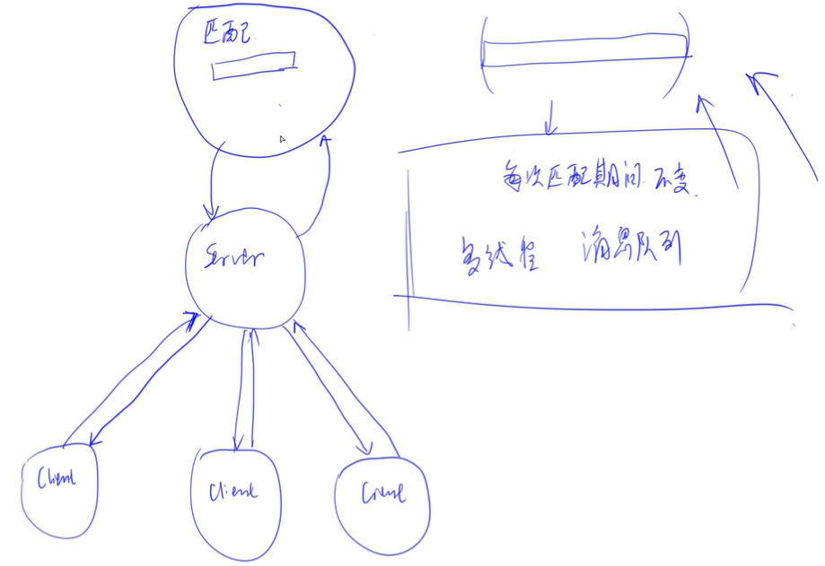

# 实现匹配系统——thrift服务

- 作者：yxc
- 链接：https://www.acwing.com/file_system/file/content/whole/index/content/3435229/
- 来源：AcWing
- 著作权归作者所有。商业转载请联系作者获得授权，非商业转载请注明出处。

<!-- @import "[TOC]" {cmd="toc" depthFrom=3 depthTo=3 orderedList=false} -->

<!-- code_chunk_output -->

- [thrift匹配系统概述](#thrift匹配系统概述)
- [创建匹配系统](#创建匹配系统)
- [匹配服务端](#匹配服务端)
- [写我们匹配系统的客户端（在 Django App 里）](#写我们匹配系统的客户端在-django-app-里)

<!-- /code_chunk_output -->

细分目录：

<!-- @import "[TOC]" {cmd="toc" depthFrom=3 depthTo=4 orderedList=false} -->

<!-- code_chunk_output -->

- [thrift匹配系统概述](#thrift匹配系统概述)
- [创建匹配系统](#创建匹配系统)
- [匹配服务端](#匹配服务端)
  - [匹配逻辑在 match_system/src/main.py 中](#匹配逻辑在-match_systemsrcmainpy-中)
  - [启动匹配服务](#启动匹配服务)
- [写我们匹配系统的客户端（在 Django App 里）](#写我们匹配系统的客户端在-django-app-里)
  - [匹配系统客户端调用匹配系统后端接口（向其发送请求）](#匹配系统客户端调用匹配系统后端接口向其发送请求)
  - [写asgi让后端可以调用channel_layer](#写asgi让后端可以调用channel_layer)
  - [增加字段后更新数据库，让数据库操作异步database_sync_to_async](#增加字段后更新数据库让数据库操作异步database_sync_to_async)

<!-- /code_chunk_output -->

打卡：
- 我的项目地址：[https://app160.acapp.acwing.com.cn/](https://app160.acapp.acwing.com.cn/)
- 我的 AcApp 地址：[https://www.acwing.com/file_system/file/content/whole/index/content/3262287/](https://www.acwing.com/file_system/file/content/whole/index/content/3262287/)
- 我的项目地址：[https://git.acwing.com/PiperLiu/acapp](https://git.acwing.com/PiperLiu/acapp)
- 我的笔记：[https://github.com/PiperLiu/back-end-notes](https://github.com/PiperLiu/back-end-notes)

### thrift匹配系统概述



- 添加一名玩家，和匹配是两个独立的过程，因此匹配系统内部要用多线程来处理
- 需要将请求缓存到`消息队列`里

这次我们匹配系统也用 python 来写。

别忘了安装 `thrift` ：

```bash
pip install thrift
```

### 创建匹配系统

我们的匹配系统与我们的应用应该是独立的。但是这里作为一个模块放在 Django 里。

```bash
cd ~/acapp
mkdir match_system  # 匹配系统
cd match_system
touch __init__.py
mkdir src  # 匹配逻辑
mkdir thrift  # thrift 配置
cd thrift/
vim match.thrift  # thrift 配置文件
```

`match_system/thrift/match.thrift`

```thrift
namespace py match_service


service Match {
    i32 add_player(1: i32 score, 2: string uuid, 3: string username, 4: string photo, 5: string channel_name),
}
```

注意第 5 个参数 `channel_name` ， `Django Channel` 里提供了一个 API ，让 Channel 外部的进程可以将数据通知到 Channel 内部，这个 API 的调用需要知道 `channel name` 。

接下来生成 `thrift` 文件。

```bash
cd ~/acapp/match_system/src/
thrift --gen py ../thrift/match.thrift
mv gen-py match_server
touch __init__.py  # 为了让本 src 在外部可以被调用
vim main.py
```

### 匹配服务端

#### 匹配逻辑在 match_system/src/main.py 中

`match_system/src/main.py`

```python
#! /usr/bin/env python3

import glob
import sys
sys.path.insert(0, glob.glob('../../')[0])

from match_server.match_service import Match

from thrift.transport import TSocket
from thrift.transport import TTransport
from thrift.protocol import TBinaryProtocol
from thrift.server import TServer

from queue import Queue
from time import sleep
from threading import Thread

from acapp.asgi import channel_layer
from asgiref.sync import async_to_sync
from django.core.cache import cache

queue = Queue()  # 消息队列

class Player:
    def __init__(self, score, uuid, username, photo, channel_name):
        self.score = score
        self.uuid = uuid
        self.username = username
        self.photo = photo
        self.channel_name = channel_name
        self.waiting_time = 0  # 等待时间


class Pool:
    def __init__(self):
        self.players = []

    def add_player(self, player):
        self.players.append(player)

    def check_match(self, a, b):
        dt = abs(a.score - b.score)
        a_max_dif = a.waiting_time * 50
        b_max_dif = b.waiting_time * 50
        return dt <= a_max_dif and dt <= b_max_dif

    def match_success(self, ps):
        print("Match Success: %s %s %s" % (ps[0].username, ps[1].username, ps[2].username))
        room_name = "room-%s-%s-%s" % (ps[0].uuid, ps[1].uuid, ps[2].uuid)
        players = []
        for p in ps:
            async_to_sync(channel_layer.group_add)(room_name, p.channel_name)
            players.append({
                'uuid': p.uuid,
                'username': p.username,
                'photo': p.photo,
                'hp': 100,
            })
        cache.set(room_name, players, 3600)  # 有效时间：1小时
        for p in ps:
            async_to_sync(channel_layer.group_send)(
                room_name,
                {
                    'type': "group_send_event",
                    'event': "create_player",
                    'uuid': p.uuid,
                    'username': p.username,
                    'photo': p.photo,
                }
            )

    def increase_waiting_time(self):
        for player in self.players:
            player.waiting_time += 1

    def match(self):
        while len(self.players) >= 3:
            self.players = sorted(self.players, key=lambda p: p.score)
            flag = False
            for i in range(len(self.players) - 2):
                a, b, c = self.players[i], self.players[i + 1], self.players[i + 2]
                if self.check_match(a, b) and self.check_match(a, c) and self.check_match(b, c):
                    self.match_success([a, b, c])
                    self.players = self.players[:i] + self.players[i + 3:]
                    flag = True
                    break
            if not flag:
                break

        self.increase_waiting_time()


class MatchHandler:
    def add_player(self, score, uuid, username, photo, channel_name):
        print("Add Player: %s %d" % (username, score))
        player = Player(score, uuid, username, photo, channel_name)
        queue.put(player)
        return 0  # 一定要有返回值


def get_player_from_queue():
    try:
        # 不阻塞
        return queue.get_nowait()  # 如果有元素，就返回元素
    except:
        return None


def worker():
    pool = Pool()
    while True:
        player = get_player_from_queue()
        if player:  # 如果不为空
            pool.add_player(player)
        else:
            pool.match()
            sleep(1)


if __name__ == '__main__':
    handler = MatchHandler()
    processor = Match.Processor(handler)
    transport = TSocket.TServerSocket(host='127.0.0.1', port=9090)
    tfactory = TTransport.TBufferedTransportFactory()
    pfactory = TBinaryProtocol.TBinaryProtocolFactory()

    # 每个请求开一个
    server = TServer.TThreadedServer(
        processor, transport, tfactory, pfactory)

    Thread(target=worker, daemon=True).start()

    print('Starting the server...')
    server.serve()
    print('done.')
```

先观察 `main` 函数：
- 每个请求开一个线程处理：`TServer.TThreadedServer`
  - `thrift` 还有其他的线程方法，比如简单线程、线程池 `TServer.TThreadPoolServer` 方法
- 在开头， `sys.path.insert(0, glob.glob('../../')[0])` 让我们可以引入 `Django` 原项目里的包（但是这样循环调用了呀， `Django app` 里面调用了 `match system` 类与对象， `match system` 里面调用了 `Django app` 类与对象，估计是这里 y 总偷懒了，没有在 `match.thrift` 里写结构体，写了结构体就可以用结构体传导，不需要循环调用）（其实这里没有循环调用，匹配系统里只是用了 `asgi` 里的 `channel_layer` ，而在 `asgi` 里，已经保证了 `django.setup()` ，具体 `asgi` 相关见下文）
- `Queue.queue` 为 Python 自带的 **线程安全** 的队列（同步队列），可以作为 **消息队列**
- 注意比如 `CalculatorHandler.add_player` 这样传给 `thrift` 通信接口的函数一定要有返回值，否者会报错

#### 启动匹配服务

因为我们在文件开头有 `#! /usr/bin/env python3` ，因此直接在命令行运行 `./main.py` 就好。

需要权限的话可以修改权限 `chmod 777 ./main.py` 。

### 写我们匹配系统的客户端（在 Django App 里）

#### 匹配系统客户端调用匹配系统后端接口（向其发送请求）

`game/consumers/multiplayer/index.py` 重写我们的多人匹配逻辑。

首先写 `create_player` 。

```python
...

from thrift import Thrift
from thrift.transport import TSocket
from thrift.transport import TTransport
from thrift.protocol import TBinaryProtocol

from match_system.src.match_server.match_service import Match
from game.models.player.player import Player
from channels.db import database_sync_to_async

...

class MultiPlayer(AsyncWebsocketConsumer):

    ...

    async def create_player(self, data):
        self.room_name = None
        self.uuid = data['uuid']
        # Make socket
        transport = TSocket.TSocket('127.0.0.1', 9090)
        # Buffering is critical. Raw sockets are very slow
        transport = TTransport.TBufferedTransport(transport)

        # Wrap in a protocol
        protocol = TBinaryProtocol.TBinaryProtocol(transport)

        # Create a client to use the protocol encoder
        client = Match.Client(protocol)

        def db_get_player():
            return Player.objects.get(user__username=data['username'])

        player = await database_sync_to_async(db_get_player)()

        # Connect!
        transport.open()

        # 调用匹配系统后端逻辑
        client.add_player(player.score, data['uuid'], data['username'], data['photo'], self.channel_name)

        # Close!
        transport.close()

    ...
```

#### 写asgi让后端可以调用channel_layer

`acapp/asgi.py`

```python
...

# 为了让匹配系统调用前端
import django
os.environ.setdefault('DJANGO_SETTINGS_MODULE', 'acapp.settings')
django.setup()  # 一定要有

...

from channels.layers import get_channel_layer
channel_layer = get_channel_layer()

...
```

修改 `game/consumers/multiplayer/index.py` ：
```python
    async def disconnect(self, close_code):
        if self.room_name:
            await self.channel_layer.group_discard(self.room_name, self.channel_name);

    ...

    async def group_send_event(self, data):
        if not self.room_name:
            keys = cache.keys('*%s*' % (self.uuid))
            if keys:
                self.room_name = keys[0]
        await self.send(text_data=json.dumps(data))
```

#### 增加字段后更新数据库，让数据库操作异步database_sync_to_async

`game/models/player/player.py`

```python
score = models.IntegerField(default=1500)
```

然后：
```bash
python3 manage.py makemigrations
python3 manage.py migrate
```

将函数从同步转为异步使用 `database_sync_to_async` 。
