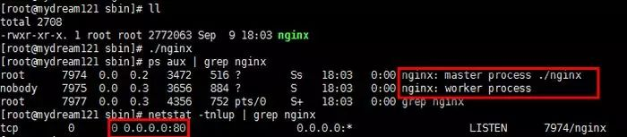

# 认识 nginx 与 uWSGI

Nginx 是一款轻量级的 HTTP 服务器，采用事件驱动的异步非阻塞处理方式框架，这让其具有极好的 IO 性能，时常用于服务端的反向代理和负载均衡。

Web服务器网关接口（Python Web Server Gateway Interface，缩写为WSGI）是为Python语言定义的Web服务器和Web应用程序或框架之间的一种简单而通用的接口。自从WSGI被开发出来以后，许多其它语言中也出现了类似接口。

参考并转载自：
- [【nginx入门】nginx反向代理与负载均衡教程](https://www.bilibili.com/video/BV1Bx411Z7Do)
- [如何理解wsgi](https://zhuanlan.zhihu.com/p/270388604)
- [连前端都看得懂的《Nginx 入门指南》](https://juejin.cn/post/6844904129987526663)
- [8分钟带你深入浅出搞懂Nginx](https://zhuanlan.zhihu.com/p/34943332)
- [Nginx详解，睡前十分钟啃完值了！](https://mp.weixin.qq.com/s/XoqGvYBabW8YBl9xEeNYZw)
- [一文详解负载均衡和反向代理的真实区别](https://mp.weixin.qq.com/s/TYM83F2O-keMvn4ZYa5nqw)


<!-- @import "[TOC]" {cmd="toc" depthFrom=3 depthTo=6 orderedList=false} -->

<!-- code_chunk_output -->

- [前置知识](#前置知识)
  - [代理](#代理)
  - [正向代理](#正向代理)
  - [反向代理](#反向代理)
  - [负载均衡](#负载均衡)
  - [负载均衡和反向代理的区别](#负载均衡和反向代理的区别)
    - [SLB 产生背景](#slb-产生背景)
    - [SLB 的三种传输模式](#slb-的三种传输模式)
    - [反向代理模式](#反向代理模式)
    - [反向代理总结](#反向代理总结)
- [Nginx](#nginx)
  - [Nginx 常用命令](#nginx-常用命令)
  - [Nginx作用与conf相应配置](#nginx作用与conf相应配置)
    - [Nginx配置简单示例](#nginx配置简单示例)
    - [动静分离与相应配置](#动静分离与相应配置)
    - [反向代理与负载均衡](#反向代理与负载均衡)
  - [一些关于Nginx的讨论](#一些关于nginx的讨论)
    - [Nginx的Master-Worker模式](#nginx的master-worker模式)
    - [Nginx如何做到热部署？](#nginx如何做到热部署)
    - [Nginx如何做到高并发下的高效处理？](#nginx如何做到高并发下的高效处理)
    - [Nginx挂了怎么办？](#nginx挂了怎么办)
- [如何理解wsgi](#如何理解wsgi)
  - [作为应用程序](#作为应用程序)
  - [作为服务器](#作为服务器)

<!-- /code_chunk_output -->

### 前置知识

#### 代理

**代理** 是在服务器和客户端之间假设的一层服务器，代理将接收客户端的请求并将它转发给服务器，然后将服务端的响应转发给客户端。

不管是正向代理还是反向代理，实现的都是上面的功能。


#### 正向代理

正向代理（`forward`）意思是一个位于客户端和原始服务器 (origin server) 之间的服务器，为了从原始服务器取得内容，客户端向代理发送一个请求并指定目标 (原始服务器)，然后代理向原始服务器转交请求并将获得的内容返回给客户端。

正向代理是为我们服务的，即为客户端服务的，客户端可以根据正向代理访问到它本身无法访问到的服务器资源。

正向代理对我们是透明的，对服务端是非透明的，即服务端并不知道自己收到的是来自代理的访问还是来自真实客户端的访问。

反向代理的作用：
- 保障应用服务器的安全（增加一层代理，可以屏蔽危险攻击，更方便的控制权限）
- 实现负载均衡
- 实现跨域（号称是最简单的跨域方式）

#### 反向代理

反向代理（`Reverse Proxy`）方式是指以代理服务器来接受 internet 上的连接请求，然后将请求转发给内部网络上的服务器，并将从服务器上得到的结果返回给 internet 上请求连接的客户端，此时代理服务器对外就表现为一个反向代理服务器。

反向代理是为服务端服务的，反向代理可以帮助服务器接收来自客户端的请求，帮助服务器做请求转发，负载均衡等。

反向代理对服务端是透明的，对我们是非透明的，即我们并不知道自己访问的是代理服务器，而服务器知道反向代理在为他服务。

#### 负载均衡

如果请求数过大，单个服务器解决不了，我们增加服务器的数量，然后将请求分发到各个服务器上，将原先请求集中到单个服务器的情况改为请求分发到多个服务器上，就是负载均衡。

Upstream 指定后端服务器地址列表，在 server 中拦截响应请求，并将请求转发到 Upstream 中配置的服务器列表。

```nginx
upstream balanceServer {
    server 10.1.22.33:12345;
    server 10.1.22.34:12345;

    server 10.1.22.35:12345;
}

server { 
    server_name  fe.server.com;
    listen 80;
    location /api {
        proxy_pass http://balanceServer;
  }
}
```

第一，通过 `upstream` 来定义一组服务，并指定负载策略（IPHASH、加权论调、最少连接），健康检查策略（ Nginx 可以监控这一组服务的状态）等。

第二，将 `proxy_pass` 替换成 `upstream` 指定的值即可。

上面的配置只是指定了 nginx 需要转发的服务端列表，并没有指定分配策略。

Nginx 支持的负载均衡调度算法方式如下：

- **weight轮询(默认，常用)**
  - 接收到的请求按照权重分配到不同的后端服务器，即使在使用过程中，某一台后端服务器宕机，Nginx会自动将该服务器剔除出队列，请求受理情况不会受到任何影响。
  - 这种方式下，可以给不同的后端服务器设置一个权重值(weight)，用于调整不同的服务器上请求的分配率；
  - 权重数据越大，被分配到请求的几率越大；该权重值，主要是针对实际工作环境中不同的后端服务器硬件配置进行调整的。
- **ip_hash（常用）**
  - 每个请求按照发起客户端的ip的hash结果进行匹配，这样的算法下一个固定ip地址的客户端总会访问到同一个后端服务器，这也在一定程度上解决了集群部署环境下session共享的问题。
- **fair**
  - 智能调整调度算法，动态的根据后端服务器的请求处理到响应的时间进行均衡分配，响应时间短处理效率高的服务器分配到请求的概率高，响应时间长处理效率低的服务器分配到的请求少；结合了前两者的优点的一种调度算法。
  - 但是需要注意的是Nginx默认不支持fair算法，如果要使用这种调度算法，请安装`upstream_fair`模块。
- **url_hash**
  - 按照访问的url的hash结果分配请求，每个请求的url会指向后端固定的某个服务器，可以在Nginx作为静态服务器的情况下提高缓存效率。
  - 同样要注意Nginx默认不支持这种调度算法，要使用的话需要安装Nginx的`hash`软件包。

#### 负载均衡和反向代理的区别

##### SLB 产生背景

SLB（Server Load Balancer, 服务器负载均衡）在多个提供相同服务的服务器的情况下，负载均衡设备存在虚拟服务地址，当大量客户端从外部访问虚拟服务IP地址时，负载均衡设备将这些报文请求根据负载均衡算法，将流量均衡的分配给后台服务器以平衡各个服务器的负载压力，避免在还有服务器压力较小情况下其他服务达到性能临界点出现运行缓慢甚至宕机情况，从而提高服务效率和质量。

因此对客户端而言，RS（real server 实际服务器）的IP地址即是负载均衡设备VIP（虚拟服务地址IP）地址，真正的RS服务器IP地址对于客户端是不可见的。

##### SLB 的三种传输模式

七层SLB和四层SLB的区别：
- 四层SLB：配置负载均衡设备上服务类型为`tcp/udp`，负载均衡设备将只解析到4层，负载均衡设备与`client`三次握手之后就会和RS建立连接；
- 七层SLB：配置负载均衡设备服务类型为 `http/ftp/https` 等，负载均衡设备将解析报文到7层，在负载均衡设备与`client`三次握手之后，只有收到对应七层报文，才会跟RS建立连接。

在负载均衡设备中，SLB主要工作在以下的三种传输模式中：
- 反向代理模式
- 透传模式
- 三角模式

根据不同的模式，负载均衡设备的工作方式也不尽相同，但无论在哪种模式下，客户端发起的请求报文总是需要先到达负载均衡设备进行处理，这是负载均衡设备正常工作的前提。

接下来的例子中，模拟网络拓扑环境：
- Client：10.8.21.40
- 负载均衡设备：172.16.75.83
- VIP：172.16.75.84
- RS1的IP：172.16.75.82
- RS2的IP：172.16.75.85

在整个报文交互过程中，采用 `Tcpdump` 和 `Wireshark` 分别在 RS 和 Client 处抓包，然后使用 Wireshark 进行报文解析。

##### 反向代理模式

反向代理：普通的代理（正向代理）设备是内网用户通过代理设备出外网进行访问，而工作在这种模式下的负载均衡设备，则是外网用户通过代理设备访问内网，因此称之为反向代理。

在反向代理模式下：
- 当`负载均衡设备`收到客户端请求后，会`记录下此报文`（ 源IP地址、目的IP地址、协议号、源端口、目的端口，服务类型以及接口索引），将报文目的地址更改为优选后的RS设备的IP地址，`目的端口号不变`，`源地址修改`为负载均衡设备下行与对应RS设备接口的IP地址，`源端口号随机发送给RS`；
- 当RS收到报文后，会以源为RS接口IP地址，目的IP设备地址回复给负载均衡设备，负载均衡设备将源修改为VIP，目的端口号修改为客户端的源端口号，目的IP修改为Client的源IP回复报文。

**查看报文解析结果：** 配置完成后，Client 访问 RS 服务器，返回成功，整个报文交互过程如下 ：


如上，整个报文交互过程：
- TCP握手过程：首先Client向负载均衡设备发送TCP SYN报文请求建立连接，源IP为Client的IP 10.8.21.40，源端口号50894，目的IP为VIP地址172.16.75.84，目的端口号80；
- 收到请求报文后，负载均衡设备会以源IP为VIP地址172.16.75.84，端口号80，目的IP 10.8.21.40，目的端口号50894回应SYN ACK报文；
- Client收到报文后回复ACK报文，TCP三次握手成功。


分析一下HTTP报文交互过程（不体现在上图）：
- 当负载均衡设备与client完成三次握手后，因为配置的七层SLB，如果收到HTTP请求，就会根据负载均衡算法和服务器健康状态优选出对应的RS（在这次过程中选择的RS设备为172.16.75.82），然后与RS建立TCP连接：
  - 负载均衡设备发送 TCP SYN 报文请求连接，源IP为负载均衡设备与RS相连接口IP 172.16.75.83，源端口号随机4574，目的IP为RS的IP 172.16.75.82，目的端口号80；
  - RS 收到报文后，以源 IP 172.16.75.82，端口号80，目的IP 172.16.75.83，目的端口号4574回复SYN ACK报文，负载均衡设备回复ACK报文建立三次握手；
  - 之后，负载均衡设备再将收到的HTTP报文源IP修改为与RS相连下行接口IP地址172.16.75.83，源端口号为随机端口号，将报文发送给RS；当RS收到报文后，使用源为本地IP 172.16.75.82，目的IP为172.16.75.83进行回复，所以报文直接回复给负载均衡设备；
- 当负载均衡设备收到RS的回应报文后，将报文的源修改为VIP地址172.16.75.84，目的IP为10.8.21.40发送回 Client，再将目的端口号修改为HTTP请求报文中的源端口号，服务器访问成功。


由上述的过程可以看出，在RS端上，client的真实IP地址被负载设备修改成与RS相连接口的IP地址，所以RS无法记录到Client的访问记录，为了解决这个问题，可以采用在HTTP报文头中添加X-Forwarded-For字段，本文不做赘述，可以自行查询。

##### 反向代理总结

反向代理是负载均衡的一种模式，这里其他两种不是不详细记录。参考：
- 反向代理和负载均衡有何区别？ - 蹦蹦啪的回答 - 知乎 https://www.zhihu.com/question/20553431/answer/130698230


### Nginx

#### Nginx 常用命令

```bash
# 快速关闭Nginx，可能不保存相关信息，并迅速终止web服务
nginx -s stop
# 平稳关闭Nginx，保存相关信息，有安排的结束web服务
nginx -s quit
# 因改变了Nginx相关配置，需要重新加载配置而重载
nginx -s reload
# 重新打开日志文件
nginx -s reopen
# 为 Nginx 指定一个配置文件，来代替缺省的
nginx -c filename
# 不运行，而仅仅测试配置文件。nginx 将检查配置文件的语法的正确性，并尝试打开配置文件中所引用到的文件
nginx -t
#  显示 nginx 的版本
nginx -v
# 显示 nginx 的版本，编译器版本和配置参数
nginx -V
# 格式换显示 nginx 配置参数
2>&1 nginx -V | xargs -n1
2>&1 nginx -V | xargs -n1 | grep lua
```

#### Nginx作用与conf相应配置

Nginx是一款自由的、开源的、高性能的HTTP服务器和反向代理服务器；同时也是一个IMAP、POP3、SMTP代理服务器；Nginx可以作为一个HTTP服务器进行网站的发布处理，另外Nginx可以作为反向代理进行负载均衡的实现。在Nginx网站上，其功能包括：
- HTTP和HTTPS（TLS / SSL / SNI）
- 超快速的Web服务器用于静态内容
- FastCGI，WSGI，SCGI用于动态内容
- 具有负载平衡和缓存功能的加速Web代理
- 不间断实时二进制升级和配置
- 压缩和内容过滤器
- 虚拟主机
- FLV和MP4的媒体流
- 带宽和连接策略
- 全面的访问控制
- 自定义日志
- 嵌入式脚本
- 带有TLS的SMTP / IMAP / POP3的邮件代理
- 逻辑，灵活，可扩展的配置
- 在Linux，FreeBSD，Mac OS X，Solaris和Windows上运行

Nginx有如下优势：
- IO多路复用epoll（IO复用）
  - 有A、B、C三个老师，他们都遇到一个难题，要帮助一个班级的学生解决课堂作业。
  - 老师A采用从第一排开始一个学生一个学生轮流解答的方式去回答问题，老师A浪费了很多时间，并且有的学生作业还没有完成呢，老师就来了，反反复复效率极慢。
  - 老师B是一个忍者，他发现老师A的方法行不通，于是他使用了影分身术，分身出好几个自己同一时间去帮好几个同学回答问题，最后还没回答完，老师B消耗光了能量累倒了。
  - 老师C比较精明，他告诉学生，谁完成了作业举手，有举手的同学他才去指导问题，他让学生主动发声，分开了“并发”。
  - 这个老师C就是Nginx。
- 轻量级
  - 功能模块少： Nginx仅保留了HTTP需要的模块，其他都用插件的方式，后天添加
  - 代码模块化： 更适合二次开发，如阿里巴巴Tengine
- CPU亲和
  - 把CPU核心和Nginx工作进程绑定，把每个worker进程固定在一个CPU上执行，减少切换CPU的cache miss，从而提高性能。

##### Nginx配置简单示例

```bash
#打开主配置文件，若你是用lnmp环境安装
vim /usr/local/nginx/conf/nginx.conf

----------------------------------------

user                    # 设置nginx服务的系统使用用户
worker_processes        # 工作进程数 一般情况与CPU核数保持一致
error_log               # nginx的错误日志
pid                     # nginx启动时的pid

events {
    worker_connections    # 每个进程允许最大连接数
    use                   # nginx使用的内核模型
}
```

我们使用 nginx 的 http 服务，在配置文件 nginx.conf 中的 http 区域内，配置无数个 server ，`每一个 server 对应这一个虚拟主机或者域名`。

```nginx
http {
    ... ...        #后面再详细介绍 http 配置项目
    
    server {
        listen 80                          # 监听端口;
        server_name localhost              # 地址
        
        location / {                       # 访问首页路径
            root /xxx/xxx/index.html       # 默认目录
            index index.html index.htm     # 默认文件
        }        
        
        error_page  500 504   /50x.html    # 当出现以上状态码时从新定义到50x.html
        location = /50x.html {             # 当访问50x.html时
            root /xxx/xxx/html             # 50x.html 页面所在位置
        }        
    }
    
    server {
        ... ... 
    } 
}
```

一个 server 可以出现多个 location ，我们对不同的访问路径进行不同情况的配置。

我们再来看看 http 的配置详情：
```nginx
http {
    sendfile  on                  # 高效传输文件的模式 一定要开启
    keepalive_timeout   65        # 客户端服务端请求超时时间
    log_format  main   XXX        # 定义日志格式 代号为main
    access_log  /usr/local/access.log  main     # 日志保存地址 格式代码 main
}
```

下面是 nginx 一些配置中常用的内置全局变量，你可以在配置的任何位置使用它们。


##### 动静分离与相应配置


如上图所示，动静分离其实就是 Nginx 服务器将接收到的请求分为动态请求和静态请求。

静态请求直接从 nginx 服务器所设定的根目录路径去取对应的资源，动态请求转发给真实的后台（前面所说的应用服务器，如图中的Tomcat）去处理。

这样做不仅能给应用服务器减轻压力，将后台api接口服务化，还能将前后端代码分开并行开发和部署。

```nginx
server {  
        listen       8080;        
        server_name  localhost;

        location / {
            root   html; # Nginx默认值
            index  index.html index.htm;
        }
        
        # 静态化配置，所有静态请求都转发给 nginx 处理，存放目录为 my-project
        location ~ .*\.(|html|htm|gif|jpg|jpeg|bmp|png|ico|jscss)$ {
            root /usr/local/var/www/my-project; # 静态请求所代理到的根目录
        }
        
        # 动态请求匹配到path为'node'的就转发到8002端口处理
        location /node/ {  
            proxy_pass http://localhost:8002; # 充当服务代理
        }
}
```

访问静态资源 nginx 服务器会返回 my-project 里面的文件，如获取 `index.html` 。

访问动态请求 nginx 服务器会将它从8002端口请求到的内容，原封不动的返回回去。


##### 反向代理与负载均衡

具体见 [上文负载均衡和反向代理的区别](#负载均衡和反向代理的区别) 。

#### 一些关于Nginx的讨论

##### Nginx的Master-Worker模式



启动 Nginx 后，其实就是在 80 端口启动了 Socket 服务进行监听，如图所示， Nginx 涉及 Master 进程和 Worker 进程。


Master进程的作用是？
- 读取并验证配置文件 nginx.conf ；
- 管理 worker 进程；

Worker 进程的作用是？
- 每一个 Worker 进程都维护一个线程（避免线程切换），处理连接和请求；
- 注意 Worker 进程的个数由配置文件决定，一般和 CPU 个数相关（有利于进程切换），配置几个就有几个 Worker 进程。

##### Nginx如何做到热部署？

所谓热部署，就是配置文件 `nginx.conf` 修改后，不需要 `stop Nginx` ，不需要中断请求，就能让配置文件生效！（`nginx -s reload` 重新加载；`nginx -t` 检查配置；`nginx -s stop`停止服务）

通过上文我们已经知道 worker 进程负责处理具体的请求，那么如果想达到热部署的效果，可以想象：

方案一：
- 修改配置文件`nginx.conf`后，主进程`master`负责推送给`woker`进程更新配置信息，`woker`进程收到信息后，更新进程内部的线程信息。（有点`valatile`的味道）

方案二：
- 修改配置文件`nginx.conf`后，重新生成新的`worker`进程，当然会以新的配置进行处理请求，而且新的请求必须都交给新的`worker`进程，至于老的`worker`进程，等把那些以前的请求处理完毕后，`kill`掉即可。

**Nginx采用的就是方案二来达到热部署的！**

##### Nginx如何做到高并发下的高效处理？

上文已经提及`Nginx`的`worker`进程个数与`CPU`绑定、`worker`进程内部包含一个线程高效回环处理请求，这的确有助于效率，但这是不够的。

作为专业的程序员，我们可以开一下脑洞：`BIO/NIO/AIO`、异步/同步、阻塞/非阻塞...

要同时处理那么多的请求，要知道，有的请求需要发生`IO`，可能需要很长时间，如果等着它，就会拖慢`worker`的处理速度。

`Nginx`采用了`Linux`的`epoll`模型，`epoll`模型基于事件驱动机制，它可以监控多个事件是否准备完毕，如果OK，那么放入`epoll`队列中，这个过程是异步的。`worker`只需要从`epoll`队列循环处理即可。

##### Nginx挂了怎么办？

`Nginx`既然作为入口网关，很重要，如果出现单点问题，显然是不可接受的。

答案是：`Keepalived+Nginx`实现高可用。

`Keepalived`是一个高可用解决方案，主要是用来防止服务器单点发生故障，可以通过和`Nginx`配合来实现Web服务的高可用。（其实，`Keepalived`不仅仅可以和`Nginx`配合，还可以和很多其他服务配合）

`Keepalived+Nginx`实现高可用的思路：
- 第一：请求不要直接打到`Nginx`上，应该先通过`Keepalived`（这就是所谓虚拟IP，VIP）
- 第二：`Keepalived`应该能监控`Nginx`的生命状态（提供一个用户自定义的脚本，定期检查`Nginx`进程状态，进行权重变化,，从而实现`Nginx`故障切换）


### 如何理解wsgi

回顾一下，我们在用`python`做`web`开发的时候，一般基于某个`web`框架来开发，`django`或者是`flask`等其它框架。 业务开发完成后，就要部署到某台服务器中提供对外的访问。

这时候你去网上一搜，他们都会告诉你需要用 `gunicorn` 或者是 `uwsgi` 来部署。 那么 `gunicorn` 、 `uwsgi` 又是什么玩意。看这个图你就明白了。


这里的 `uwsgi` 或者 `gunicorn` 扮演的角色就是 `web` 服务器的角色，这里的服务器是软件层面的服务器，用于处理浏览器发过来的 `HTTP` 请求以及将响应结果返回给前端。而 `Web` 框架的主要任务就是处理业务逻辑生成结果给 `web` 服务器，再由 `web` 服务器返回给浏览器。

而 `web` 框架和 `web` 服务器之间的通信需要遵循一套规范，这个规范就是WSGI了。

为什么要搞这么一套规范出来？ 规范就是为了统一标准，方便大家所用。

想象一下，我们手机充电的接口现在都是 `Type-c` 的，`Type-c` 就是一种规范， 手机厂商按照这个规范去生产手机， 充电器厂商按照 `Type-c` 的规范生产充电器，不同厂商的手机就可以和不同厂商的充电器搭配使用。 而苹果却自成一套规范，最后导致 `Android` 充电器无法给苹果充电。

那如何写出一个符合 `WSGI` 规范的应用（框架）程序和服务器呢？


如上图所示，左边是 `web` 服务器，右边是 `web` 框架，或者说应用程序。

#### 作为应用程序

`WSGI` 规定应用程序必须是一个可调用对象（可调用对象可以是函数，也可以是类，还可以是实现了 `__call__`的实例对象），而且必须接受两个参数，该对象的返回值必须是可迭代对象。

我们可以写个最简单的应用程序的例子：

```python
HELLO_WORLD = b"Hello world!\n"

def application(environ, start_response):
    status = '200 OK'
    response_headers = [('Content-type', 'text/plain')]
    start_response(status, response_headers)
    return [HELLO_WORLD]
```

`application` 是一个函数，肯定是可调用对象，然后接收两个参数，两个参数分别是： `environ` 和 `start_response`
- `environ` 是一个字典，里面储存了 `HTTP request` 相关的所有内容，比如 `header` 、请求参数等等
- `start_response` 是一个 `WSGI` 服务器传递过来的函数，用于将 `response header` ，状态码传递给 `Server` 。

调用 `start_response` 函数负责将响应头、状态码传递给服务器， 响应体则由 `application` 函数返回给服务器， 一个完整的 `http response` 就由这两个函数提供。

但凡是实现了 `wsgi` 的 `web` 框架都会有这样一个可调用对象。

#### 作为服务器

`WSGI` 服务器端做的事情就是每次接收 `HTTP` 请求，构建 `environ` 对象，然后调用 `application` 对象，最后将 `HTTP Response` 返回给浏览器。

下面就是一个完整的 `wsgi server` 的代码：

```python
import socket
import sys
from io import StringIO


class WSGIServer(object):
    address_family = socket.AF_INET
    socket_type = socket.SOCK_STREAM
    request_queue_size = 1

    def __init__(self, server_address):
        # Create a listening socket
        self.listen_socket = listen_socket = socket.socket(
            self.address_family,
            self.socket_type
        )
        # Allow to reuse the same address
        listen_socket.setsockopt(socket.SOL_SOCKET, socket.SO_REUSEADDR, 1)
        # Bind
        listen_socket.bind(server_address)
        # Activate
        listen_socket.listen(self.request_queue_size)
        # Get server host name and port
        host, port = self.listen_socket.getsockname()[:2]
        self.server_name = socket.getfqdn(host)
        self.server_port = port
        # Return headers set by Web framework/Web application
        self.headers_set = []

    def set_app(self, application):
        self.application = application

    def serve_forever(self):
        listen_socket = self.listen_socket
        while True:
            # New client connection
            self.client_connection, client_address = listen_socket.accept()
            # Handle one request and close the client connection. Then
            # loop over to wait for another client connection
            self.handle_one_request()

    def handle_one_request(self):
        self.request_data = request_data = self.client_connection.recv(1024)
        # Print formatted request data a la 'curl -v'
        print(''.join(
            '< {line}\n'.format(line=line)
            for line in request_data.splitlines()
        ))
        self.parse_request(request_data)
        # Construct environment dictionary using request data
        env = self.get_environ()
        # It's time to call our application callable and get
        # back a result that will become HTTP response body
        result = self.application(env, self.start_response)
        # Construct a response and send it back to the client
        self.finish_response(result)

    def parse_request(self, text):
        request_line = text.splitlines()[0]
        request_line = request_line.rstrip('\r\n')
        # Break down the request line into components
        (self.request_method,  # GET
         self.path,  # /hello
         self.request_version  # HTTP/1.1
         ) = request_line.split()

    def get_environ(self):
        env = {}
        # The following code snippet does not follow PEP8 conventions
        # but it's formatted the way it is for demonstration purposes
        # to emphasize the required variables and their values
        #
        # Required WSGI variables
        env['wsgi.version'] = (1, 0)
        env['wsgi.url_scheme'] = 'http'
        env['wsgi.input'] = StringIO.StringIO(self.request_data)
        env['wsgi.errors'] = sys.stderr
        env['wsgi.multithread'] = False
        env['wsgi.multiprocess'] = False
        env['wsgi.run_once'] = False
        # Required CGI variables
        env['REQUEST_METHOD'] = self.request_method  # GET
        env['PATH_INFO'] = self.path  # /hello
        env['SERVER_NAME'] = self.server_name  # localhost
        env['SERVER_PORT'] = str(self.server_port)  # 8888
        return env

    def start_response(self, status, response_headers, exc_info=None):
        # Add necessary server headers
        server_headers = [
            ('Date', 'Tue, 31 Mar 2015 12:54:48 GMT'),
            ('Server', 'WSGIServer 0.2'),
        ]
        self.headers_set = [status, response_headers + server_headers]
        # To adhere to WSGI specification the start_response must return
        # a 'write' callable. We simplicity's sake we'll ignore that detail
        # for now.
        # return self.finish_response

    def finish_response(self, result):
        try:
            status, response_headers = self.headers_set
            response = 'HTTP/1.1 {status}\r\n'.format(status=status)
            for header in response_headers:
                response += '{0}: {1}\r\n'.format(*header)
            response += '\r\n'
            for data in result:
                response += data
            # Print formatted response data a la 'curl -v'
            print(''.join(
                '> {line}\n'.format(line=line)
                for line in response.splitlines()
            ))
            self.client_connection.sendall(response)
        finally:
            self.client_connection.close()


SERVER_ADDRESS = (HOST, PORT) = 'localhost', 8080


def make_server(server_address, application):
    server = WSGIServer(server_address)
    server.set_app(application)
    return server


if __name__ == '__main__':
    httpd = make_server(SERVER_ADDRESS, application)
    print('WSGIServer: Serving HTTP on port {port} ...\n'.format(port=PORT))
    httpd.serve_forever()
```

当然，如果只是写个用于开发环境用的`server`，用不着这么麻烦自己造轮子，因为`python`内置模块中就提供有 `wsgi server` 的功能。

```python
from wsgiref.simple_server import make_server
srv = make_server('localhost', 8080, application)
srv.serve_forever()
```

只要3行代码就可以提供`wsgi`服务器，是不是超级方便，最后来访问测试下浏览器发起一个请求的效果。


以上就是`wsgi`简介，深入了解`wsgi`可以熟悉下`PEP333`。
